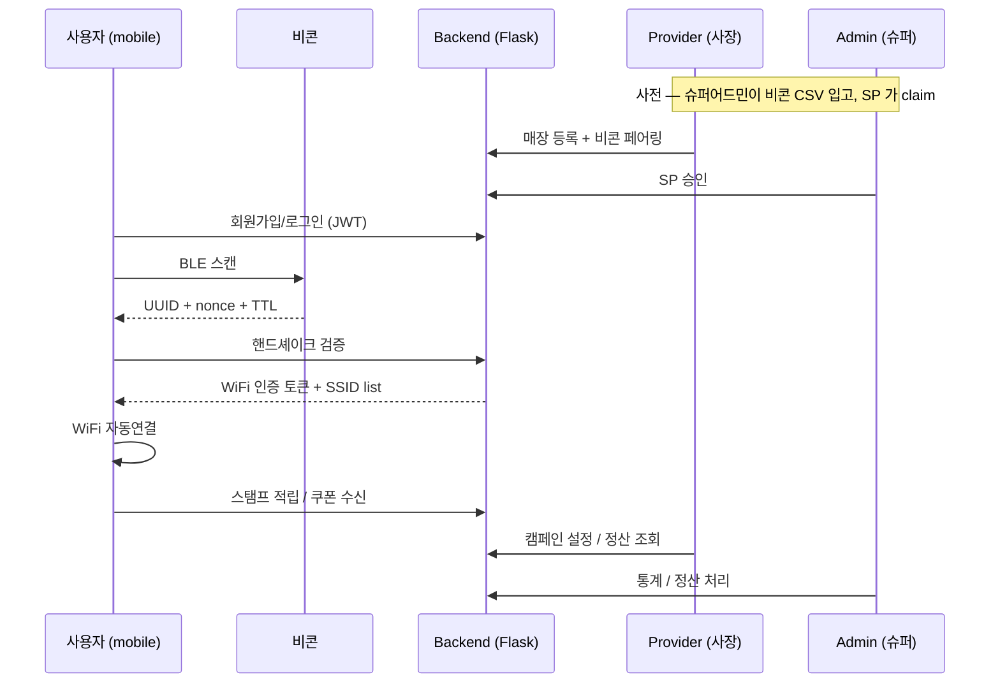

# PathWave 전체 시스템 아키텍처

> **버전**: v0.1 골격 (2026-05-26)
> **트랙**: 실제 개발 (`docs/internal/`) — 창업지원단 제출용 SOW 와 별개
> **상태**: 골격만 작성. 각 component 의 상세는 `spec/*.md` 에서.

---

## 1. 한 줄 정의

> **PathWave** = BLE 비콘 + 클라우드 핸드셰이크 기반 **무중단 WiFi 로밍** 으로 매장/리조트 방문객에게 자동 인증·자동 재연결·자동 매장발견을 제공하는 LBS 플랫폼. 부가로 외국인 관광객 자동 응대(23개 언어 메뉴/채팅 번역) + 면세 처리.

## 2. 3 콘솔 + 백엔드 1

```
                ┌──────────────────────────────────────────┐
                │           Master Backend (Flask)         │
                │  ─ /Users/m5pro16/Desktop/pathwave/      │
                │  ─ models/database.py (SQLite, master)   │
                │  ─ routes/*.py                           │
                │  ─ JWT auth + super_admin role           │
                └────────┬──────────┬───────────┬──────────┘
                         │          │           │
                  write+ │   read   │ read+full │ read+
                  read   │  index   │  master   │ index
                         ▼          ▼           ▼
                  ┌──────────┐ ┌──────────┐ ┌──────────┐
                  │ mobile   │ │  admin   │ │ provider │
                  │ (Flutter)│ │  -web    │ │  -web    │
                  │ 보라 #7C │ │ 블루 #25 │ │ 녹색 #22 │
                  │ 3AED     │ │ 63EB     │ │ C55E     │
                  └──────────┘ └──────────┘ └──────────┘
                  사용자(소비) 슈퍼어드민  시설관리자(사장)
                              (총책임)   (1계정=1매장)
```

| 콘솔 | 디렉토리 | 역할 | 접근 권한 |
|---|---|---|---|
| **mobile** | `mobile/` (Flutter) | 사용자 앱 — BLE 인식·WiFi 자동연결·스탬프·쿠폰·채팅 | read 인덱스 + 본인 데이터 |
| **provider-web** | `provider-web/` (React/Vue, 반응형 PC) | 시설관리자(사장) — 매장 등록·비콘 페어링·캠페인·정산 | read 인덱스 + 본인 매장 write |
| **admin-web** | `admin-web/` (React/Vue, PC) | 슈퍼어드민 — SP 승인·비콘 자산·정산·카테고리·신고 | master DB full |
| **backend** | `app.py` + `routes/` | Flask + SQLite (마스터) | 모든 콘솔 게이트웨이 |

자세히: [`spec/data-architecture.md`](spec/data-architecture.md)

## 3. 핵심 기능 ⭐ (USP)

### 3.1 무중단 WiFi 로밍 (Phase 1 B 스코프)
- **방식 C 비콘 주도** (사용자 직접 확정).
- 비콘이 신호강도를 기반으로 다음 AP/SSID 를 푸시 → mobile 이 미리 `.mobileconfig` (iOS) / WiFiConfig (Android) 다건 설치 → 끊김 없이 핸드오프.
- 1회 인증 후 리조트 내 이동해도 끊김 0.
- 자세히: [`spec/wifi-roaming.md`](spec/wifi-roaming.md)

### 3.2 BLE 클라우드 핸드셰이크
- 비콘 (FSC-BP108B, BLE 5.x) → UUID 광고 + nonce + TTL → 클라우드 검증 → WiFi 자동연결.
- 양산 OTA, 신호 만료, 서버 검증.
- 자세히: [`spec/beacon-protocol.md`](spec/beacon-protocol.md)

### 3.3 한국 방문 외국인 자동 응대 (USP)
- **23개 언어 i18n DB** (Phase 1 = 10개: ko/en/zh-CN/ja/zh-TW/vi/th/tl/id/ms).
- 메뉴 자동 번역 (tesseract OCR + DeepL).
- 채팅 자동 번역 (한국어 ↔ 23개 언어).
- 외국인 결제 (알리페이/위챗페이) + 면세 자동.
- 자세히: [`spec/i18n-strategy.md`](spec/i18n-strategy.md) · [`spec/payment-integration.md`](spec/payment-integration.md)

## 4. 데이터 흐름 (가입 → 사용 → 정산)



## 5. 기술 스택

| 영역 | 기술 | 비고 |
|---|---|---|
| Backend | Flask + SQLite | 마스터. PostgreSQL 이전 검토 (출시 후) |
| mobile | Flutter (Dart) | iOS + Android 동시 |
| provider-web | (확정 필요) | 반응형 PC 웹 |
| admin-web | (확정 필요) | PC 웹 |
| Auth | JWT + super_admin role | `routes/auth.py` |
| i18n | DB-driven (`translations` 테이블 + `GET /api/i18n/{lang}`) | DeepL 1회 번역 후 캐시 |
| 결제 | 토스페이먼츠 + 알리페이/위챗페이 (Phase 2) | `payments/` |
| 알림 | Firebase FCM | iOS APNs + Android |
| 로그/모니터링 | Sentry | 출시 직전 |
| 지도 | Google Maps API | provider 등록 시 |

## 6. 인프라 & 자동화 로드맵

- **현재**: M5pro 1대로 충분 (로컬 dev + sqlite + headless Chrome 테스트)
- **출시 직전**: Mac mini 중고 1대 추가 검토 (60~80만원) — Fastlane / CI / 무인 빌드용
- **출시 직후**: 클라우드 무료 tier (Vercel + Supabase + Firebase)
- **자동화**: Stage 1 (월 5~15만) → Stage 2 (15~40만) → Stage 3 (30~100만)
- 자세히: [`spec/automation-roadmap.md`](spec/automation-roadmap.md)

## 7. 외부 서비스 의존성

| 서비스 | 용도 | 신청 순서 | 비용 |
|---|---|---|---|
| 토스페이먼츠 | 결제 (한국) | 1순위 (심사 1~2주) | 수수료 |
| Firebase | FCM 알림 | 2순위 | 무료 tier |
| SendGrid | 이메일 | 3순위 | 무료 tier |
| Apple Developer | 앱 심사 | 법인카드 후 | $99/년 |
| Google Play | 앱 심사 | 법인카드 후 | $25 일회 |
| Sentry | 에러 추적 | 출시 직전 | 무료 tier |
| Google Maps API | 매장 지도 | 출시 직전 | 무료 tier |
| DeepL Pro | 번역 | i18n 시드 시 1회 | $25 1회 |

## 8. 출시 단계 (사용자 직접 정의)

1. **로컬개발 + 테스트데이터** (현재)
2. **법인카드 후 외부 계정/서버/서비스 신청**
3. **소스+서버 업데이트 후 테스트**
4. **스토어 심의**
5. **서비스 시작**

자세히: 메모리 `project_launch_sequence.md`

## 9. 페르소나 (14종) — 테스트 기준

| 그룹 | 페르소나 |
|---|---|
| 외국인 사용자 | 영어/중국어 본토/일본/베트남/태국 |
| 한국인 사용자 | 20대 직장인 / 50대 부부 / 학생 |
| 시설관리자 | 소규모 카페 / 중대형 리조트 / 정산담당 |
| 슈퍼어드민 | 신규 SP 심사 / 정산 처리 / 신고 처리 |

자세히: `docs/pathwave_persona_test_scenarios_2026-05-26.xlsx` + `docs/build_test_scenarios.py`

## 10. 브랜드 전략 (요약)

> ⭐ **"PathWave 가 메인이라는 인식이 박혀야 뺏기지 않음"** (사용자 직접, 2026-05-17)

- 출시 직후 도도/토스 통합 ❌ (브랜드 흡수 위험)
- Stage 1 (독립 브랜드 확립) → Stage 2 (갑 포지션) → Stage 3 (통합 표준)
- 모든 접점에 PathWave 로고/이름 명시
- 자세히: 메모리 `project_brand_strategy.md`

## 11. 진행 상태 추적 (단일 진실)

- **단일 추적 문서**: `docs/pathwave_launch_master_plan_2026-05-20.md`
- **Phase 1 PR plan**: `docs/pathwave_phase1_plan_2026-05-21.md`
- 본 문서는 **아키텍처 골격만** — 상태/PR 추적은 위 두 문서.

## 12. spec/ 인덱스

| 파일 | 내용 | 상태 |
|---|---|---|
| [`spec/data-architecture.md`](spec/data-architecture.md) | 마스터 DB + read 인덱스 + 환경 분리 | ✅ v0.1 |
| [`spec/beacon-protocol.md`](spec/beacon-protocol.md) | BLE 5.x + nonce + TTL + OTA | ✅ v0.1 |
| [`spec/wifi-roaming.md`](spec/wifi-roaming.md) | 방식 C 비콘 주도 무중단 핸드오프 | ✅ v0.1 |
| [`spec/i18n-strategy.md`](spec/i18n-strategy.md) | 23개 언어 DB i18n + DeepL | ⏳ TBD |
| [`spec/function-spec.md`](spec/function-spec.md) | 3 콘솔 기능 (분할 가능) | ⏳ TBD |
| [`spec/subscription-billing.md`](spec/subscription-billing.md) | **provider 구독료만** (토스 빌링키). 사용자 결제·면세·외국인결제 없음 (Phase 2+ 검토) | ⏳ TBD |
| [`spec/automation-roadmap.md`](spec/automation-roadmap.md) | Stage 1~3 자동화 (**출시 후 — 챗봇 포함**) | ⏳ TBD |
| [`spec/store-review-compliance.md`](spec/store-review-compliance.md) | Apple HIG + Material 3 + 심의 | ⏳ TBD |

각 spec 은 사용자 요청 시 채움 — 한꺼번에 작성하지 않음 (토큰 효율).
