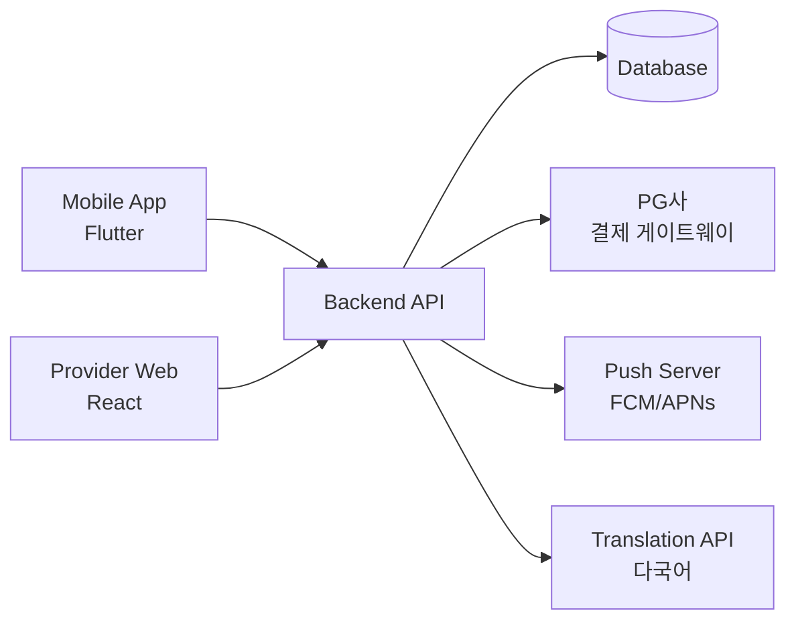
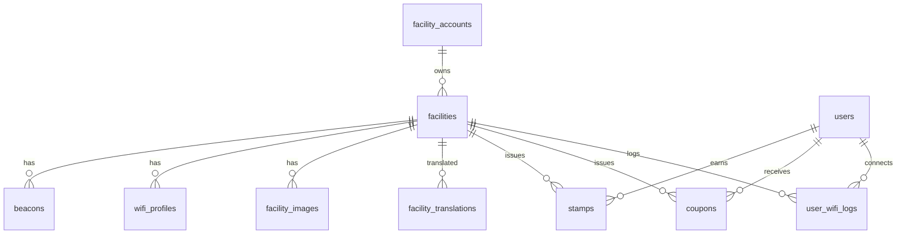

# PathWave 서비스 요구사항 명세서 (SRS)

**문서 버전**: v1.0  
**작성일**: 2026-05-03  
**프로젝트**: PathWave — BLE 기반 근거리 서비스 플랫폼

---

## 1. 시스템 개요

### 1.1 서비스 정의
PathWave는 BLE(Bluetooth Low Energy) 비콘 기반의 근거리 서비스 플랫폼으로, **서비스 시설(매장)**이 방문객에게 와이파이 자동 접속, 쿠폰/스탬프 발급, 알림 발송 등의 서비스를 제공하는 O2O 솔루션입니다.

### 1.2 시스템 구성

| 플랫폼 | 기술 스택 | 대상 사용자 |
|--------|----------|-----------|
| **Provider Web** (관리자 포털) | React + Vite | 서비스 시설 운영자/관리자 |
| **Mobile App** (엔드유저) | Flutter | 일반 소비자 (매장 방문객) |
| **Backend API** | Python (FastAPI/Flask) | 양쪽 클라이언트 공용 |
| **Database** | SQLite → PostgreSQL(운영) | 중앙 데이터 저장소 |

### 1.3 연계 구조

---

## 2. 사용자 역할 정의

| 역할 | 코드 | 권한 범위 |
|------|------|----------|
| **대표** | `owner` | 전체 관리 (시설등록, 직원관리, 결제, 설정) |
| **관리자** | `admin` | 서비스 운영 (매장정보, 쿠폰, 스탬프, 알림, 채팅) |
| **직원** | `staff` | 제한적 운영 (채팅 응대, 스탬프 적립) |
| **앱 유저** | `user` | 모바일 앱 소비자 (쿠폰 수령, 스탬프 적립, 채팅) |

---

## 3. 기능 요구사항

### 3.1 회원가입 및 인증

#### FR-AUTH-001: 시설 회원가입
- **입력 필드**: 업체명(상호), 사업자등록번호, 로그인 이메일, 비밀번호(8자 이상), 비밀번호 확인, 담당자 성함, 담당자 연락처, 담당자 이메일
- **유효성 검사**:
  - 이메일 형식 검증 + 중복 체크 (실시간)
  - 사업자등록번호 형식 검증 (000-00-00000)
  - 비밀번호 강도 검증 (영문+숫자+특수문자 조합, 8자 이상)
  - 비밀번호 확인 일치 여부
- **프로세스**: 가입 신청 → 이메일 인증 코드 발송 → 인증 완료 → 대시보드 이동
- **DB 테이블**: `facility_accounts`

#### FR-AUTH-002: 로그인
- **입력 필드**: 이메일, 비밀번호
- **프로세스**: 이메일/비밀번호 입력 → 인증 → JWT 토큰 발급 → 대시보드 이동
- **추가 기능**: 비밀번호 찾기 (이메일 인증 코드 방식)
- **세션 관리**: Access Token (15분) + Refresh Token (7일)

#### FR-AUTH-003: 앱 유저 회원가입 (Mobile)
- **소셜 로그인**: Google, Apple, Kakao, Naver
- **이메일 로그인**: 이메일 + 비밀번호
- **DB 테이블**: `users` (provider: email/google/apple/kakao/naver)
- **탈퇴 처리**: `deleted_at` 기록, 7일 후 재가입 가능

#### FR-AUTH-004: 이메일 인증
- 6자리 숫자 코드 발송
- 유효기간: 5분
- **DB 테이블**: `email_codes`

---

### 3.2 대시보드

#### FR-DASH-001: 통계 카드
- **매장 수**: 운영 중인 시설 수 (facilities WHERE active=1)
- **활성 비콘**: 활성 비콘 수 (beacons WHERE status='active')
- **접속자 수**: 이번 달 와이파이 접속자 (user_wifi_logs, 당월 집계)
- **쿠폰 발급**: 이번 달 발급 쿠폰 수 (coupons, 당월 집계)
- **트렌드 지표**: 전월 대비 증감률 (%)
- **터치 동작**: 각 카드 터치 시 해당 관리 페이지로 navigate

#### FR-DASH-002: 차트
- **와이파이 접속 추이**: Area Chart, 최근 7일, 일별 집계
- **서비스별 매출**: Bar Chart, 최근 4개월, wifi/이벤트/알림
- **쿠폰 사용률**: Donut Chart, 발급/사용/만료 비율
- **데이터 소스**: API에서 집계 데이터 조회

---

### 3.3 매장 관리

#### FR-STORE-001: 매장 정보 등록/수정
- **기본 정보**: 매장명, 주소(지도 연동), 전화번호, 영업시간, 설명
- **이미지 관리**: 다중 이미지 업로드, 대표 이미지 지정
- **DB 테이블**: `facilities`, `facility_images`
- **다국어**: 매장명/주소/설명 자동 번역 + 캐시 (`facility_translations`)

#### FR-STORE-002: 시설 지도 연동
- **지도 API**: 네이버 지도 / Google Maps
- **기능**: 주소 검색 → 좌표(lat/lng) 자동 입력
- **Mobile 연계**: 앱에서 주변 시설 검색 시 좌표 기반 거리 계산

---

### 3.4 와이파이 관리

#### FR-WIFI-001: 와이파이 프로필 설정
- **입력 필드**: SSID, 비밀번호
- **보안**: 비밀번호 AES 암호화 저장
- **활성/비활성**: 토글 스위치
- **DB 테이블**: `wifi_profiles`

#### FR-WIFI-002: 비콘 관리
- **비콘 등록**: 시리얼번호(SN), UUID
- **상태 관리**: active / inactive / inventory
- **모니터링**: 배터리 잔량(%), 펌웨어 버전
- **DB 테이블**: `beacons`

#### FR-WIFI-003: 접속 로그
- **자동 기록**: 사용자가 비콘 영역 진입 시 와이파이 자동 접속 → 로그 저장
- **DB 테이블**: `user_wifi_logs`
- **Mobile 연계**: BLE 스캔 → 비콘 UUID 매칭 → 와이파이 자동 연결

---

### 3.5 스탬프 관리

#### FR-STAMP-001: 스탬프 정책 설정
- **혜택 조건**: N개 적립 시 혜택 제공 (예: 10개 적립 → 1잔 무료)
- **적립 방식**: BLE 비콘 근접 시 자동 / 관리자 수동 적립 / QR코드
- **유효기간**: 발급일 기준 N일
- **디자인**: 스탬프 카드 이미지 커스터마이징

#### FR-STAMP-002: 스탬프 적립/조회
- **적립**: 사용자ID + 시설ID + 수량 + 메모
- **보정**: 관리자가 오적립 시 수량 조정 가능
- **DB 테이블**: `stamps`
- **Mobile 연계**: 앱에서 적립 현황 실시간 조회

---

### 3.6 쿠폰 관리

#### FR-COUPON-001: 쿠폰 생성
- **입력 필드**: 쿠폰명, 혜택 내용, 유효기간, 발급 대상 조건
- **발급 방식**: 자동(비콘 영역 진입) / 수동(관리자 발급) / 스탬프 혜택 연동
- **상태**: 발급 / 사용 / 만료

#### FR-COUPON-002: 쿠폰 사용 처리
- **사용 확인**: QR코드 스캔 또는 관리자 수동 처리
- **DB 테이블**: `coupons` (used 필드)
- **Mobile 연계**: 앱에서 보유 쿠폰 목록, 사용 처리

---

### 3.7 직원 관리

#### FR-STAFF-001: 직원 초대
- **프로세스**: 이메일 입력 → 역할 선택(관리자/직원) → 초대 발송
- **초대 상태**: 초대중 / 수락 / 만료
- **만료 기간**: 7일
- **재초대**: 만료 시 재발송 가능

#### FR-STAFF-002: 직원 관리
- **목록 표시**: 프로필 아바타, 이름, 역할 뱃지, 이메일, 상태
- **역할 변경**: 대표만 가능
- **삭제/해제**: 대표만 가능, ConfirmModal 확인
- **역할별 권한**: 대표(전체) > 관리자(운영) > 직원(제한)

#### FR-STAFF-003: 회원정보 탭
- **계정 정보**: 이메일, 가입일, 마지막 로그인
- **비밀번호 변경**: 현재 비밀번호 + 새 비밀번호 + 확인
- **회원 탈퇴**: ConfirmModal → 비밀번호 재입력 → 탈퇴 처리

---

### 3.8 결제 관리

#### FR-PAY-001: 결제 수단 관리
- **카드 등록**: PG사 빌링키 발급 (토스페이먼츠/KG이니시스)
- **카드 표시**: 카드사명, 마스킹된 카드번호 (****-****-****-6789)
- **카드 교체**: 기존 빌링키 삭제 → 새 빌링키 발급
- **빈 상태**: 카드 미등록 시 "+ 결제카드등록" 안내

#### FR-PAY-002: 서비스 신청 (5단계 스텝)
- **Step 1 — 서비스 선택**: wifi / 이벤트 / 알림 중 선택
- **Step 2 — 플랜 선택**: 수량, 약정기간(월간/연간), 단가 표시, 할인율
- **Step 3 — 주문 확인**: 서비스명, 플랜, 수량, 공급가액, 부가세(10%), 총 결제금액
- **Step 4 — PG 결제**: 등록된 카드로 결제 → 로딩 → 성공/실패
- **Step 5 — 완료**: ✓ 아이콘 + 결과 요약 + "결제관리로 돌아가기"
- **상단 인디케이터**: ①②③④⑤ 진행 바 (완료=녹색, 현재=강조)

#### FR-PAY-003: 서비스 이용 관리
- **이용 현황**: 서비스별 이용 수량, 결제금액, 약정기간, 신청일
- **서비스 종료**: ConfirmModal → 약정 위약금 안내 → 종료 처리
- **서비스 연장**: ConfirmModal → 동일 조건 자동 갱신

#### FR-PAY-004: 결제 내역
- **테이블**: 일시, 매장명, 결제금액, 서비스 유형
- **기간**: 최대 24개월 조회
- **빈 상태**: "결제내역이 없습니다." 안내 메시지
- **더보기**: 페이지네이션

#### FR-PAY-005: 영수증 이메일
- **이메일 등록**: 결제/공지 안내 수신용
- **인라인 편집**: 이메일 변경 → input 전환 → 저장/취소
- **자동 발송**: 결제 완료 시 영수증 이메일 발송

---

### 3.9 채팅

#### FR-CHAT-001: 1:1 고객 채팅
- **채팅 목록**: 프로필, 이름, 최근 메시지, 시간, 읽지 않은 수
- **채팅 상세**: 대화 버블 (송신=녹색/우측, 수신=회색/좌측)
- **시간 표시**: HH:MM 형식
- **읽음 표시**: "✓ 읽음 HH:MM"
- **온라인 상태**: 녹색 점 + "온라인" 텍스트

#### FR-CHAT-002: 메시지 기능
- **텍스트 전송**: 입력바 + 전송 버튼
- **Mobile 연계**: 앱 사용자가 시설에 문의 → 관리자 포털에서 응대
- **푸시 알림**: 새 메시지 수신 시 FCM/APNs 알림

---

### 3.10 알림 발송

#### FR-NOTI-001: 알림 생성/발송
- **입력 필드**: 제목, 내용 (글자 수 제한), 발송 대상, 예약 시간
- **발송 방식**: 즉시 / 예약 (24시간 형식)
- **잔여 수량 체크**: 발송 가능 수량 확인 → 부족 시 서비스 신청 안내
- **상태**: 발송대기 / 발송완료 / 실패

#### FR-NOTI-002: 알림 이력
- **목록**: 제목, 발송일, 상태 뱃지, 수신 대상 수
- **정렬**: 최신순

---

### 3.11 리포트

#### FR-REPORT-001: 통계 대시보드
- **방문객 추이**: 일별/주별/월별 방문자 수 (Line/Area Chart)
- **매출 통계**: 서비스별 매출 집계 (Bar Chart)
- **스탬프/쿠폰 통계**: 발급/사용/만료 비율 (Pie/Donut Chart)
- **기간 필터**: 최근 7일 / 30일 / 3개월 / 6개월 / 1년

> [!WARNING]
> 현재 리포트 페이지는 플레이스홀더 상태. 차트 구현 필요.

---

### 3.12 다국어 지원

#### FR-I18N-001: 관리자 포털 다국어
- **지원 언어**: 한국어(ko), 영어(en), 일본어(ja), 중국어(zh)
- **구현**: i18next + react-i18next
- **번역 파일**: `src/locales/{lang}/translation.json`
- **언어 전환**: 설정 페이지에서 변경

#### FR-I18N-002: 매장 정보 자동 번역
- **자동 번역**: 매장명, 주소, 설명을 등록 시 자동 번역
- **캐시**: 1회 번역 후 DB 캐시 (`facility_translations`)
- **Mobile 연계**: 앱 사용자 언어에 따라 번역된 매장 정보 표시

---

## 4. 비기능 요구사항

### 4.1 디자인 시스템

| 항목 | 사양 |
|------|------|
| 폰트 | Noto Sans KR (Regular 400 / Light 300) |
| 최소 폰트 | 12px (`--pw-caption-size`) |
| 본문 폰트 | 16px (`--pw-body-size`) — Apple HIG 최소 기준 |
| 메인 컬러 | `#16A34A` (녹색) |
| 터치 타겟 | 최소 44px (Apple HIG) / 48dp (Material) |
| 반응형 | Mobile: 390px+ / Tablet: 768px+ / PC: 1280px+ |
| 컴포넌트 | Button, ConfirmModal, BottomActionBar (공통) |

### 4.2 보안

| 항목 | 요구사항 |
|------|---------|
| 인증 | JWT (Access 15분 + Refresh 7일) |
| 비밀번호 | bcrypt 해싱, 최소 8자 |
| 와이파이 비밀번호 | AES-256 암호화 저장 |
| API 통신 | HTTPS(TLS 1.3) 필수 |
| CORS | 허용 도메인 화이트리스트 |

### 4.3 성능

| 항목 | 목표치 |
|------|--------|
| 페이지 로드 | ≤ 2초 (FCP) |
| API 응답 | ≤ 500ms (P95) |
| BLE 스캔 | ≤ 3초 (비콘 감지) |
| 동시 접속 | 10,000 사용자 |

### 4.4 호환성

| 플랫폼 | 최소 버전 |
|--------|----------|
| iOS | 15.0+ |
| Android | 10.0+ (API 29) |
| Chrome | 90+ |
| Safari | 15+ |
| Edge | 90+ |

---

## 5. Provider Web ↔ Mobile App 연계 매트릭스

| 기능 | Provider Web (관리자) | Mobile App (사용자) | API |
|------|---------------------|-------------------|-----|
| 회원가입 | ✅ 시설 가입 | ✅ 소셜/이메일 가입 | `/auth/register` |
| 로그인 | ✅ 이메일 | ✅ 소셜 + 이메일 | `/auth/login` |
| 매장 정보 | ✅ 등록/수정 | ✅ 조회 (다국어) | `/facilities` |
| 와이파이 | ✅ SSID/비번 설정 | ✅ 자동 접속 | `/wifi` |
| 비콘 | ✅ 등록/관리 | ✅ BLE 스캔/감지 | `/beacons` |
| 스탬프 | ✅ 정책 설정/적립 | ✅ 적립 현황 조회 | `/stamps` |
| 쿠폰 | ✅ 생성/발급 | ✅ 수령/사용 | `/coupons` |
| 채팅 | ✅ 응대 | ✅ 문의 | `/chat` (WebSocket) |
| 알림 | ✅ 발송 | ✅ 수신 (Push) | `/notifications` |
| 결제 | ✅ PG 결제/관리 | — | `/payments` |
| 리포트 | ✅ 통계 조회 | — | `/reports` |
| 직원 관리 | ✅ 초대/관리 | — | `/staff` |

---

## 6. 데이터 모델 (현행)

### 추가 필요 테이블

| 테이블 | 설명 | 상태 |
|--------|------|------|
| `staff_members` | 시설별 직원 관리 (role, invite_status) | ❌ 미구현 |
| `payments` | 결제 내역 (order_no, amount, pg_tid) | ❌ 미구현 |
| `service_subscriptions` | 서비스 구독 (type, quantity, period) | ❌ 미구현 |
| `billing_keys` | PG 빌링키 (masked_card, pg_key) | ❌ 미구현 |
| `chat_rooms` | 채팅방 | ❌ 미구현 |
| `chat_messages` | 채팅 메시지 | ❌ 미구현 |
| `notifications` | 알림 발송 이력 | ❌ 미구현 |
| `report_daily` | 일별 집계 캐시 | ❌ 미구현 |

---

## 7. 구현 현황 (2026-05-03 기준)

| 모듈 | 프론트엔드 | 백엔드 API | DB 모델 |
|------|-----------|-----------|---------|
| 회원가입/로그인 | ✅ | ⚠️ Mock | ✅ |
| 대시보드 | ✅ (차트 포함) | ❌ | — |
| 매장 관리 | ✅ | ⚠️ Mock | ✅ |
| 와이파이 | ✅ | ⚠️ Mock | ✅ |
| 스탬프 | ✅ | ⚠️ Mock | ✅ |
| 쿠폰 | ✅ | ⚠️ Mock | ✅ |
| 직원 관리 | ✅ | ❌ | ❌ |
| 결제/서비스 신청 | ✅ (PG 시뮬레이션) | ❌ | ❌ |
| 채팅 | ✅ | ❌ | ❌ |
| 알림 발송 | ✅ | ❌ | ❌ |
| 리포트 | ❌ 플레이스홀더 | ❌ | ❌ |
| 다국어 | ✅ (i18n 설정) | ⚠️ 번역 캐시 | ✅ |
| 설정 | ✅ | ❌ | — |
